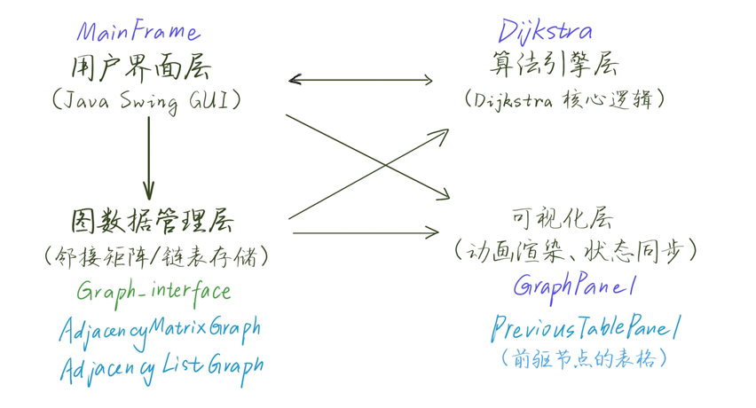

# Dijkstra可视化系统
山东大学软件学院数据结构课程设计——Dijkstra可视化系统

---
### 注意
1. ***可以借鉴，禁止抄袭***
2. 作者能力有限，可能代码不是很美观，有点凌乱
---
### 课设题目
- ***最短路径—Dijkstra算法***
>设计实现有向网结构，针对随机有向网实例和随机源点，用Dijkstra算法求解出单源点到其他各顶点的最短路径，给出求解过程的动态演示。可考虑实现不同存储结构上的实现。
---
### 程序构成
1. dj（主体）
2. server（下载文件时Socket类通讯的服务器端，IP为回环IP）
3. exception（用来处理填写的一些错误逻辑）
---
### 前端
- 采用`javaSwing`GUI框架
---
### 技术架构（dj）


---
### 具备功能
```
1. 生成随机图
2. 增删边
3. 设置源点
4. 查询最短路径
5. 动态演示（暂停/继续/结束/步进/速度设置）
6. 切换存储结构（邻接矩阵/邻接链表）
7. 文件保存/导入/下载
8. 界面颜色更改
9. 帮助菜单
10. 快捷键
11. 错误反馈（弹窗/日志）
```